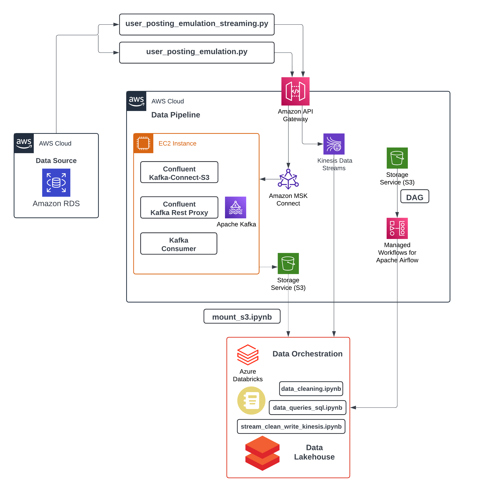
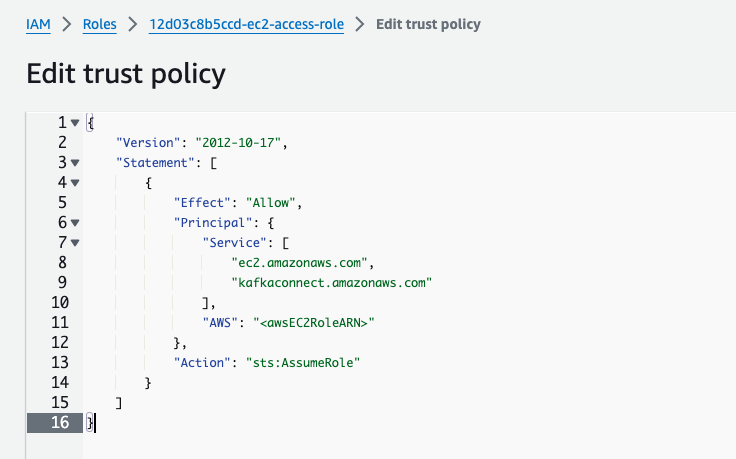
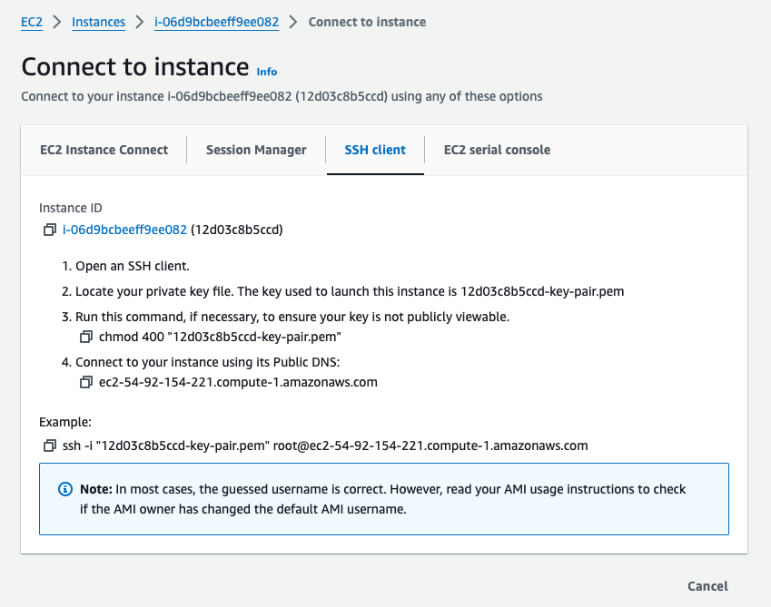
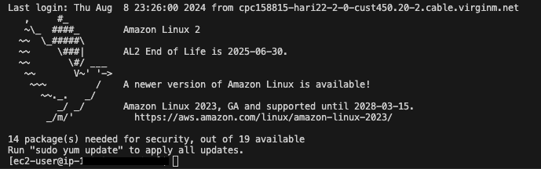
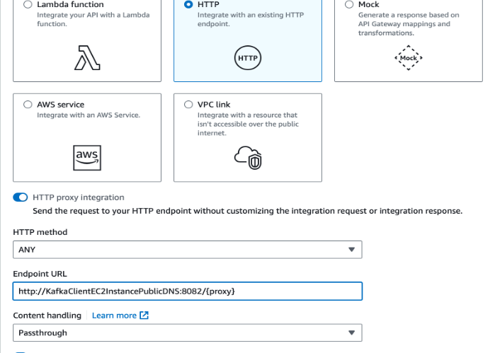
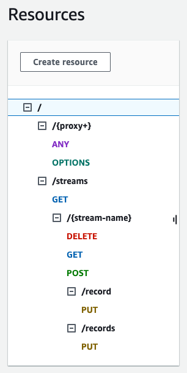

# Pinterest Data Pipeline

## Table of Contents
1. [Project Description](#project-description)
2. [Installation Instructions](#installation-instructions)
3. [Usage Instructions](#usage-instructions)
4. [File Structure](#file-structure)
5. [License Information](#license-information)

## Project Description
The Pinterest Data Pipeline project aims to build a data pipeline that emulates how a platform such as Pinterest might handle, process, and analyze large volumes of data. This project demonstrates how to integrate various AWS services, Apache Kafka, and Databricks for batch and stream processing. 

**Project Architecture:**



### Project Aim:
The goal of this project is to provide hands-on experience in setting up and managing a data pipeline, focusing on data collection, processing, storage, and real-time data streaming. 

- **Data Emulation:** Simulate Pinterest data posting using a script that retrieves data from an Amazon RDS instance.
- **Batch Processing:** Use Apache Kafka to process data and store it securely in Amazon S3.
- **Real-Time Data Streaming with Kinesis:** Stream data to AWS Kinesis and process it in real-time with Databricks.
- **Workflow Management:** Manage Workflows for Apache Airflow (MWAA) using Directed Acyclic Graphs (DAGs).
- **Data Analysis:** Perform data cleaning and run complex SQL queries using Databricks.

### Skills Learned:
This project provided hands-on experience with:
- **AWS Services:** IAM, EC2, S3, MSK, and Kinesis.
- **Apache Kafka:** Real-time data streaming and processing on AWS.
- **Databricks:** Data cleaning, transformation, and analysis.
- **Apache Airflow (MWAA):** Orchestrating data workflows with DAGs.
- **Real-time Streaming:** Using AWS Kinesis and Databricks for real-time data handling.

## Installation Instructions

### Prerequisites

- **Python 3.x**: Ensure that you have Python 3.x installed on your local machine.

- **Required Python Packages**: Install the following Python packages using pip to manage database connections, AWS interactions, and API requests:
  - `SQLAlchemy`: For SQL database management.
  - `PyMySQL`: For MySQL database connectivity.
  - `boto3`: The AWS SDK for Python to interact with AWS services like S3, EC2, and more.
  - `pyyaml`: For handling YAML files, used for storing configuration data.
  - `requests`: For making HTTP requests, such as sending data to API endpoints.

  You can install all required packages with the following command:
    ```bash
    pip install SQLAlchemy PyMySQL boto3 pyyaml requests
    ```

- **AWS Account** An AWS account with the following services configured:
  - `IAM`: Set up appropriate roles and policies, including IAM roles for EC2 and Kinesis access.
  - `EC2`: An EC2 instance configured with the necessary permissions and key pairs for secure SSH access.
  - `S3`: An S3 bucket set up to store processed data.

- **Databricks Account** A Databricks account for processing and analysing the data. Ensure the following is configured:
  - `Clusters`: A Databricks cluster for running Spark jobs.
  - `S3 Bucket Mount`: Your S3 bucket should be mounted in Databricks to read and write data.
  
### Step-by-Step Setup

1. **Local Setup:**

    Step 1: Clone Git repository:

      ```bash 
        git clone https://github.com/carlacostan/pinterest-data-pipeline.git 
      ```

    Step 2: Update db_config_path in db_connector.py:

      * Open the `db_connector.py` file located in the root of the cloned repository.

      * Locate the following line in the __init__ method of the AWSDBConnector class:
        ```python
        def __init__(self, db_config_path=''):
        ```
      * Replace the path with the correct path to your db_creds.yml file on your local machine. 

      > **_NOTE:_** This step is crucial as it ensures that your scripts can locate and load the necessary database credentials.

2. **AWS Environment Setup:**

    Step 1: Create an IAM user and role for EC2, MSK, and Kinesis

     * For this project, this has already can be created. Navigate to 'Roles' in IAM and find the following: `<UserID>-ec2-access-role`.
     * Make a note of the role ARN and Public DNS.
     * In the 'Trust Relationships' section click on 'Edit trust policy'. Click on 'Add a principal' and choose IAM roles as the Principal type. Insert the <awsEC2RoleARN> when prompted.

    

    > **_NOTE:_** This step is important as it will allow IAM authentication, so ensure that the trust relationships configured correctly
    
    Step 2: Create a `.pem` key file locally named `<UserID>-key-pair.pem`

     * Your private key file file has to be added to .gitignore to ensure it is not uploaded to GitHub.

    Step 3: Create the RSA private key for SSH connection

     * Navigate to EC2 > Key pairs and create a RSA key, copy and paste the **private key** into your **.pem** file.
     * Set the appropriate permissions for the file using the command below in a terminal on your local machine:
       ```bash
       chmod 400 /path/to/<UserID>-key-pair.pem
       ```
    
    Step 4: Launch an EC2 instance using SSH client authentication

    * Use the following command in a terminal to connect to your EC2 instance:
      ```
      ssh -i /path/to/private_key.pem ec2-user@public_dns_name
      ```

    

     > **_NOTE:_**  Ensure you have the correct region selected, in this project it is `us-east-1`.

    * You will see the following in your terminal:

    

3. **Kafka Setup on the EC2 instance:**

    Step 1: Ensure Java 8 is installed on the EC2 instance.
    
      * Use `java -version` to verify if it is installed.
      * If not installed, use `sudo apt install openjdk-8-jdk`.
      * Edit your shell configuration file `~/.bashrc`using a text editor to add the following JAVA_HOME environment variable: 
        ```bash
        export JAVA_HOME="/path/to/java8"
        ```

     Step 2: Download and Install Kafka.

      * Use `wget https://archive.apache.org/dist/kafka/3.0.0/kafka_2.12-2.8.1.tgz` to install the Kafka .tgz file

      > **_NOTE:_** Ensure version 2.12-2.8.1 is installed as otherwise Kafka will not be able to communicate with the MSK cluster for this project

      * Navigate to the directory where you downloaded Kafka and extract using:
        ```bash
        tar -xzf kafka_2.12-2.8.1.tar
        ```

      * Move into the Kafka directory by running the command:
        ```bash
        cd kafka_2.12-2.8.1
        ```

    Step 3: Set up Kafka.

      * Use a text editor to edit the `client.properties` inside the `kafka/bin` directory to ensure that Kafka can securely connect to your MSK cluster using IAM roles, as follows:
        ```python
        # Sets up TLS for encryption and SASL for authN.
        security.protocol = SASL_SSL

        # Identifies the SASL mechanism to use.
        sasl.mechanism = AWS_MSK_IAM

        # Binds SASL client implementation.
        sasl.jaas.config = software.amazon.msk.auth.iam.IAMLoginModule required awsRoleArn="Your Access Role";

        # Encapsulates constructing a SigV4 signature based on extracted credentials.
        # The SASL client bound by "sasl.jaas.config" invokes this class.
        sasl.client.callback.handler.class = software.amazon.msk.auth.iam.IAMClientCallbackHandler
        ```

      > **_NOTE:_** The correct setup of Kafka on your EC2 instance is crucial for ensuring that your data pipeline functions correctly with the AWS MSK cluster.

    Step 4: Create Kafka topics for the pin, geo and user data

      * Navigate to the MSK console in AWS to retrieve the **Bootstrap Servers String** and **Plaintext Apache Zookeeper connection string**. Make a note of these.
      * Download the IAM MSK authentication package in the **kafka/libs** directory
        ```bash
        wget https://github.com/aws/aws-msk-iam-auth/releases/download/v1.1.5/aws-msk-iam-auth-1.1.5-all.jar
        ```
      * Ensure that your CLASSPATH is set correctly to include the path to the Kafka libraries and IAM authenticator:
        ```bash
        export CLASSPATH=/usr/local/kafka/libs/aws-msk-auth.jar:$CLASSPATH
        ```
      * Create the Pinterest post topic:
        ```bash
        kafka-topics.sh --create --bootstrap-server <BootstrapServerString> --replication-factor 3 --partitions 1 --topic <your_UserId>.pin
        ```
      * Create the geolocation data topic:
        ```bash
        kafka-topics.sh --create --bootstrap-server <BootstrapServerString> --replication-factor 3 --partitions 1 --topic <your_UserId>.geo
        ```
      * Create the user data topic:
        ```bash
        kafka-topics.sh --create --bootstrap-server <BootstrapServerString> --replication-factor 3 --partitions 1 --topic <your_UserId>.user
        ```

4. **S3 and MSK Connect Setup:**

    Step 1: Identify the S3 bucket.

    * Navigate to the S3 console in your AWS account.
    * Locate the bucket associated with your UserId. The bucket name should follow this format: `user-<your_UserId>-bucket`.
    * Make a note of this bucket name as you will need it for the subsequent steps.

   Step 2: Download and Upload the Confluent.io Amazon S3 Connector.

    * On your EC2 instance, open a terminal.
    * Download the Confluent.io Amazon S3 Connector
        ```bash
        # Make the directory where the connector will be installed
        mkdir kafka-connect-s3 && cd kafka-connect-s3
        # Download the Confluent connector
        wget https://d2p6pa21dvn84.cloudfront.net/api/plugins/confluentinc/kafka-connect-s3/versions/10.5.13/confluentinc-kafka-connect-s3-10.5.13.zip
        # Unzip the file
        unzip confluentinc-kafka-connect-s3-10.5.13.zip
        # Navigate to the kafka-rest directory
        confluent-7.2.0/etc/kafka-rest
        # Open the kafka-rest.properties in a text editor
        nano kafka-rest.properties
        ```
    * Modify `kafka-rest.properties` with the `bootstrap.servers` and the `zookeeper.connect` variables in this file with the ones obtained earlier. Also add the following for IAM authentication:
        ```bash
        # Sets up TLS for encryption and SASL for authN.
        client.security.protocol = SASL_SSL
        # Identifies the SASL mechanism to use.
        client.sasl.mechanism = AWS_MSK_IAM
        # Binds SASL client implementation.
        client.sasl.jaas.config = software.amazon.msk.auth.iam.IAMLoginModule required awsRoleArn="Your Access Role";
        # Encapsulates constructing a SigV4 signature based on extracted credentials.
        # The SASL client bound by "sasl.jaas.config" invokes this class.
        client.sasl.client.callback.handler.class = software.amazon.msk.auth.iam.IAMClientCallbackHandler
        ```
    * Upload the connector to the S3 bucket:
      ```bash
      aws s3 cp ./confluentinc-kafka-connect-s3-10.5.13.zip s3://user-<your_UserId>-bucket/kafka-connect-s3/
      ```
   > **_NOTE:_** Make a note of the S3 URI where the connector is stored as it will be used for setting up the MSK Connect plugin.

   Step 3: Create a Custom Plugin in MSK Connect.

    * Navigate to the MSK Connect console in AWS.
    * Create a custom plugin using the S3 URI of the uploaded connector. For this project, you can only create a plugin with the name `<UserId>-plugin`, so ensure you use this exact name.
    * When specifying the plugin source, use the S3 path from where you uploaded the connector in the previous step.

   Step 4: Set Up the Connector in MSK Connect.

    * In the **MSK Connect** console, select **'Connectors'** and choose **'Create Connector'**.
    * For this project, you can only create a connector with the name `<your_UserId>-connector`. Ensure you use this exact name.
    * Select plug `<UserID>-plugin` and the MSK Cluster `pinterest_msk-cluster.
    * Copy the following into your **'Connector configuration'**
        ```bash
        connector.class=io.confluent.connect.s3.S3SinkConnector
        # Same region as our bucket and cluster
        s3.region=us-east-1
        flush.size=1
        schema.compatibility=NONE
        tasks.max=3
        # Include nomeclature of topic name, given here as an example will read all data from topic names starting with msk.topic....
        topics.regex=<UserID>.*
        format.class=io.confluent.connect.s3.format.json.JsonFormat
        partitioner.class=io.confluent.connect.storage.partitioner.DefaultPartitioner
        value.converter.schemas.enable=false
        value.converter=org.apache.kafka.connect.json.JsonConverter
        storage.class=io.confluent.connect.s3.storage.S3Storage
        key.converter=org.apache.kafka.connect.storage.StringConverter
        s3.bucket.name=<user-<UserID>-bucket>
        ```
    > **_NOTE:_** Ensure you replace <UserID> with your actual User ID.
    * In **'Access Permission'** select the IAM role `<UserID>-ec2-access-role`.
    * Data passing through the IAM authenticated cluster will now automatically be stored in the S3 bucket.

5. **API Gateway REST API Setup:**

    Step 1: Create a Resource.

      * Navigate to API gateway in AWS and click **'Create Resource'**.

    Step 2: Create a ANY Method.

      * Click on the ANY resource, then on the Edit integration button. Follow the format below, the Endpoint URL should be `http://KafkaClientEC2InstancePublicDNS:8082/{proxy}`:

    

    Step 3: Stage and deploy the API.

      * Choose a stage name and deploy the API.
      * Make a note of the **Invoke URL**.
      * Modify the db_cred.yml script to include your API Gateway invoke URL in this format:
        ```json
        API_INVOKE_URL: "<Your-Invoke-URL>"
        ```
    Step 4: Start the REST proxy.

      * Navigate to the `confluent-7.2.0/bin` directory and run the following command:
        ```bash
        ./kafka-rest-start /home/ec2-user/confluent-7.2.0/etc/kafka-rest/kafka-rest.properties
        ```
      * A **'INFO Server started, listening for requests...'** should appear in your EC2 console

6. **Databricks Setup:**
    
      * For this project, a Databricks account has been supplied with a cluster.
      * AWS Access Key and Secret Access Key for Databricks have been uploaded, the following code exists in `mount_s2.ipynb`for accessing them:
        ```python
        # The path to the Delta table containing the credentials
        credentials_path = "dbfs:/user/hive/warehouse/authentication_credentials"

        # Read the Delta table into a DataFrame
        credentials_df = spark.read.format("delta").load(credentials_path)
        credentials = credentials_df.collect()[0]  
        access_key = credentials['Access key ID']  
        secret_key = credentials['Secret access key']  
        ```

      * Import the following Python Notebooks into the Databricks workspace:
        
          - `mount_s3.ipynb`
          - `data_cleaning.ipynb`
          - `data_queries_sql.ipynb`
          - `stream_and_clean_kinesis_data.ipynb`

## Usage Instructions

### Scripts Overview

  - **`db_connector.py`**: This script sets up the connection to the AWS RDS MySQL database using SQLAlchemy. It includes methods to fetch data from the Pinterest tables.

  - **`user_posting_emulation.py`**: This script simulates Pinterest users posting data by randomly selecting rows from the database and sending them to the Kafka topics (pin, geo, user) via the API Gateway.

  - **`user_posting_emulation_streaming.py`**: Similar to the `user_posting_emulation.py` script but designed for streaming data in real-time using AWS Kinesis.

  - **`mount_s3.ipynb`**: A Databricks notebook that mounts the S3 bucket containing the Pinterest data to the Databricks file system (DBFS) for further processing.

  - **`data_cleaning.ipynb`**: A Databricks notebook for cleaning and preprocessing the data from S3 before analysis. This includes tasks such as handling missing values and formatting fields.

  - **`data_queries_sql.ipynb`**: A Databricks notebook that runs various SQL queries on the cleaned data to derive insights, such as finding the most popular categories, median follower counts, and user statistics.

  - **`stream_clean_write_kinesis_data.ipynb`**: This notebook handles real-time streaming data from AWS Kinesis, cleans it, and stores it in Delta tables in Databricks for immediate analysis.

### Running the Data Pipeline

1. **Data Emulation:**

    Step 1: Modify the `db_creds.yml` file.
      
      * Ensure your API Gateway invoke URL is correctly set in the `db_cred.yml` file in this format:
        ```yaml
        API_INVOKE_URL: "<Your-Invoke-URL>"
        ```

    Step 2: Run the `user_posting_emulation.py` script.

      *  This script will simulate user posts by retrieving data from the MySQL database and sending it to the Kafka topics via the API Gateway.
      * The data will be automatically saved in your designated S3 bucket through the MSK Connect configuration.

      > **_NOTE:_** Ensure the Kafka REST Proxy is running on your EC2 instance before executing this script.

2. **Data Processing in Databricks:**

    Step 1: Mount the S3 bucket to Databricks.
    
      * Open the `mount_s3.ipynb` notebook in Databricks.
      * Replace the placeholder for `bucket_name` with the actual S3 bucket name.
      * Replace the paths in `pin_data_path`, `geo_data_path` and `user_data_path` with the actual paths to the JSON objects.
      * Run the notebook to mount the S3 bucket, making the data accessible for processing.

    Step 2: Clean and preprocess the data.

      * Open and run the `data_cleaning.ipynb` notebook to clean and format the data retrieved from S3.

    Step 3: Analyze the data using SQL queries.
    
      * Open the `data_queries_sql.ipynb` notebook.
      * Run the SQL queries provided to generate insights from the Pinterest data.

3. **Real-Time Data Streaming:**

    **Set Up AWS Kinesis Streams:**

    Step 1: Create Kinesis Streams.
    
    * Three data streams were set up using AWS Kinesis, specifically named:
      - `streaming-<UserID>-pin`: For Pinterest post data.
      - `streaming-<UserID>-geo`: For geolocation data.
      - `streaming-<UserID>-user`: For user data.

    > **_NOTE:_** Ensure that your stream names follow this exact format.

    **Configure the REST API for Kinesis Actions:**

      Step 1: Set up API Gateway to interact with Kinesis.
      
      * Using the API Gateway that was previously set up for Kafka, additional configurations were made to support interactions with the Kinesis streams. This includes actions such as listing streams, creating streams, describing streams, deleting streams, and adding records to streams.

      Step 2: Configure the "streams" Resource.
      
      * A new resource named `streams` was created with a **GET** method to perform the `ListStreams` action. This allows the API to list all the Kinesis streams associated with your account.

      * In the integration type settings for this method, the following configurations were applied:
        - **AWS Region**: `us-east-1`.
        - **AWS Service**: `Kinesis`.
        - **HTTP Method**: `POST`.
        - **Action Type**: `User action name`.
        - **Action Name**: `ListStreams`.
        - **Execution Role**: `arn:aws:iam::<AccountID>:role/<UserID>-kinesis-access-role`.
        
        > **_NOTE:_** This execution role is crucial for allowing the API Gateway to interact with your Kinesis streams.

      * Within the Integration Request tab, the following was added:
        - **Header**: `application/x-amz-json-1.1` with `Content-Type` as the header type.
        - **Mapping Template**: `{}` with `application/json` as the content type.

    **Add Child Resources and Methods:**

      Step 1: Create `{stream-name}` Child Resource.
      
      * Under the `streams` resource, a child resource named `{stream-name}` was added. This child resource was configured with the following methods:
        - **GET**: To perform the `DescribeStream` action, which retrieves details about a specific Kinesis stream.
        - **POST**: To perform the `CreateStream` action, allowing the creation of a new stream with specified parameters.
        - **DELETE**: To perform the `DeleteStream` action, removing a stream from Kinesis.

      Step 2: Define Mapping Templates for the Methods.
      
      * **GET Method**:
        - The mapping template takes the input from an API request and extracts the `StreamName` parameter.
      * **POST Method**:
        - If empty, it defaults to a value of 5; otherwise, it uses the value provided in the request.
        - The `StreamName` is also extracted as in the GET method.
      * **DELETE Method**:
        - Similar to the GET method, the template extracts the `StreamName` from the incoming request to identify which stream to delete.

     **Handle Record Insertion into Kinesis Streams:**

      Step 1: Create Resources for Record Insertion.
      
      * Two additional child resources were created under `{stream-name}` named `record` and `records`.
      * These resources handle individual and multiple record insertions into the Kinesis streams, respectively.
      
      Step 2: Configure PUT Methods for Data Insertion.
      
      * **PUT Method for `record` Resource**:
        - This method is configured to handle single record insertions into a Kinesis stream.
        - The mapping template transforms the incoming JSON payload into the required format for Kinesis.
        - The `Data` field in the request is base64 encoded using `$util.base64Encode()` because Kinesis requires data in this format.
        - The `PartitionKey` is also extracted from the input request.

      * **PUT Method for `records` Resource**:
        - This method is designed to handle batch insertions into the Kinesis stream.
        - The mapping template iterates over an array of records, encoding each `Data` field and ensuring the correct JSON structure.
        - A conditional statement adds commas between records, ensuring the output remains valid JSON.
      
    

     **Run the Real-Time Streaming Pipeline:**

      Step 1: Run the `user_posting_emulation_streaming.py` script.
      
      * Update the `db_cred.yml` script with your API Gateway URL and run `user_posting_emulation_streaming.py` to start streaming real-time data into the three Kinesis streams.
      * This script will continuously send data from your MySQL database to the Kinesis streams.

      Step 2: Process Streaming Data in Databricks.
      
      * Open the `stream_clean_write_kinesis_data.ipynb` notebook in Databricks.
      * This notebook reads data from the Kinesis streams in real-time, applies necessary data cleaning, and stores the cleaned data in Delta tables for further analysis.
      
      > **_NOTE:_** The real-time streaming data pipeline allows for immediate processing and analysis of user activity, geolocation, and post data, providing near-instant insights from the incoming data.

4. **Workflow Automation:**

    Step 1: Deploy the Airflow DAG.

     **Upload the DAG File to S3:**
      - Navigate to the S3 console in your AWS account.
      - Locate the S3 bucket that is associated with your AWS MWAA environment. This bucket is typically named something like `mwaa-dags-bucket`.
      - Upload your DAG file (e.g., `<UserID>_dag.py`) to the `dags` folder within this S3 bucket.

     **Deploy the DAG in Apache Airflow UI:**
      - Access the Apache Airflow UI provided by AWS MWAA. You can do this by navigating to the MWAA console in AWS and clicking on the "Open Airflow UI" button.
      - Once in the Airflow UI, you should see your newly uploaded DAG listed under the "DAGs" tab. If not, refresh the page or check the S3 upload.
      - To deploy the DAG, unpause it by toggling the switch next to the DAG name. This will activate the DAG and allow it to run according to its schedule.

     **Automate Data Processing Tasks:**
      - The DAG is designed to automate daily data processing tasks on Databricks. It will trigger the execution of your Databricks notebooks (e.g., `data_cleaning.ipynb`) to process and analyze the data collected in the pipeline.
      - This automation ensures that your data pipeline runs smoothly and consistently without manual intervention.

    > **_NOTE:_** You can monitor the status of your DAG executions, view logs, and manage any issues that arise directly through the Airflow UI. This interface provides a comprehensive overview of your workflow, including task durations, dependencies, and potential bottlenecks.

## File Structure

```bash
PINTEREST-DATA-PIPELINE
├── README.md
├── dags
│   └── 12d03c8b5ccd_dag.py
├── databricks_notebooks
│   ├── data_cleaning.ipynb
│   ├── data_queries_sql.ipynb
│   ├── mount_S3.ipynb
│   └── stream_clean_write_kinesis_data.ipynb
├── db_connector.py
├── db_creds.yml
├── user_posting_emulation.py
└── user_posting_emulation_streaming.py
```

## License Information

This project is developed as part of an advanced training program by AI Core, specialising in Data Engineering. The content and structure are owned by the creators of the program, and while you are welcome to explore and learn from this project, please attribute any derivative works appropriately. 
